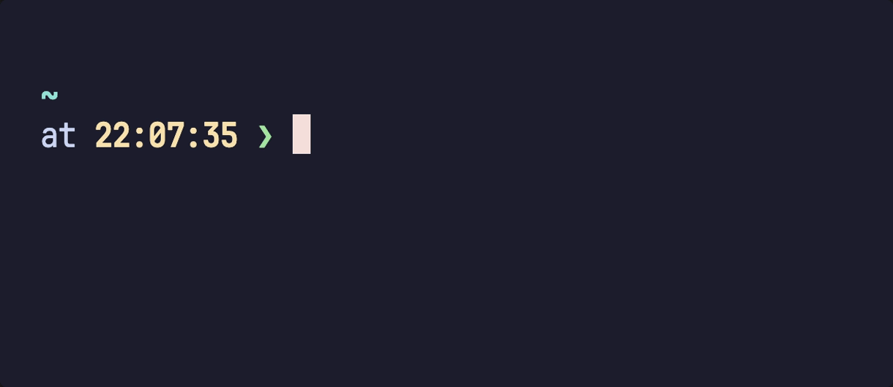

# capsule

`capsule` は Rust 実装の `zsh` 用プロンプトエンジンです。macOS と Linux で動作します。

<p align="center">
  
</p>

常駐デーモンがレンダリング・キャッシュ・低速モジュールの非同期更新を担います。`zsh` はコプロセス経由でプロンプトリクエストを中継するため、プロンプトは即座に表示され、バックグラウンド処理が完了すると非同期で更新されます。

## プロンプト

```
<directory> on <git branch> [indicators] via <toolchain> took <duration>
at <time> ❯
```

**1行目:** ディレクトリ、git ステータス、カスタムモジュール、コマンド実行時間。ツールチェインセグメント（`via <toolchain>` の部分）は組み込み実装を持たず、ユーザー定義の `[[module]]` エントリによってのみ提供されます。

**2行目:** 時刻（デフォルト無効）、プロンプト文字 `❯` / `❮`（vim コマンドモード）。文字は成功時に緑、失敗時に赤になります。

1行目はターミナル幅を超える場合、まずディレクトリを短縮し、次に末尾のセグメントを省略します。

## インストール

要件: macOS または Linux、`zsh`。

```bash
# 1. バイナリのインストール
brew install shuymn/tap/capsule

# 2. システムサービスマネージャへの登録（推奨）
capsule daemon install   # macOS: launchd  |  Linux: systemd --user

# 3. .zshrc へ追記
eval "$(capsule init zsh)"
```

toolchainモジュールを用意するには、`capsule preset` を実行してその出力を設定ファイルに貼り付けます。

## 設定

設定ファイルは最初に存在するパスから読み込まれます:

1. `$XDG_CONFIG_HOME/capsule/config.toml`
2. `~/.config/capsule/config.toml`
3. `~/.capsule/config.toml`

変更は次回のレンダリング時に自動的に反映されます。

### 組み込みモジュール

```toml
[character]
glyph = "❯"
success_style = { fg = "green", bold = true }
error_style = { fg = "red", bold = true }

[character.vicmd]           # vim コマンドモードの上書き
glyph = "❮"
# style = { fg = "yellow" }

[directory]
style = { fg = "cyan", bold = true }
# read_only_style = { fg = "red" }

[git]
icon = "\u{f418}"
connector = "on"
style = { fg = "magenta", bold = true }
indicator_style = { fg = "red", bold = true }
# detached_hash_style = { fg = "green", bold = true }
# state_style = { fg = "yellow", bold = true }

[time]
disabled = true             # 有効にするには false を設定
format = "HH:MM:SS"         # または "HH:MM"
connector = "at"
style = { fg = "yellow", bold = true }

[cmd_duration]
threshold_ms = 2000
connector = "took"
style = { fg = "yellow", bold = true }
```

### コネクタとタイムアウト

```toml
[connectors]
# style = {}

[timeout]
fast_ms = 500       # 環境変数/ファイルソース
slow_ms = 5000      # コマンド、git
```

### スタイル構文

| キー     | 型    | 説明                 |
|----------|-------|----------------------|
| `fg`     | color | 前景色               |
| `bold`   | bool  | 太字                 |
| `dimmed` | bool  | 薄暗く（faint）表示  |

色: `red`, `green`, `yellow`, `blue`, `magenta`, `cyan`, `bright_black`。

`[color_map]` で ANSI コードを上書き（classic 30〜37 およびbright 90〜97）:

```toml
[color_map]
green = 32
cyan = 36
```

### カスタムモジュール

```toml
[[module]]
name = "rust"
when.files = ["Cargo.toml"]
format = "v{version}"
icon = "🦀"
connector = "via"
style = { fg = "red" }

# ソースが複数ある場合は、非同期で解決して最初に成功した結果が使われます。
[[module.source]]
name = "version"
env = "RUST_VERSION"

[[module.source]]
name = "version"
command = ["rustc", "--version"]
regex = 'rustc ([\d.]+)'
```

環境変数/ファイルソースはインラインで評価されます。コマンドソースはバックグラウンドで実行され、プロンプトを非同期で更新します。

#### フォーマット文字列構文

| 構文     | 意味 |
|----------|------|
| `{name}` | 変数プレースホルダ。未解決の場合はモジュール全体が非表示 |
| `[…]`    | オプションセクション。内部の変数が未解決の場合は省略 |
| `{{`     | リテラル `{` |
| `[[`     | リテラル `[` |

```toml
format = "{profile}[ ({region})]"   # region が未解決の場合は省略
```

#### グルーピング

同じディレクトリで複数のモジュールが適用可能な場合、グループ内で最も低い `priority` を持つモジュールのみがレンダリングされます:

```toml
arbitration = { group = "runtime", priority = 10 }
```

`arbitration` を持たないモジュールは常にレンダリングされます。

## CLI

```
capsule daemon              デーモンの起動
capsule daemon install      サービスの登録（macOS: launchd、Linux: systemd）
capsule daemon uninstall    サービスの削除
capsule connect             Coprocess リレー（init スクリプトが使用）
capsule init zsh            シェル統合スクリプトの出力
capsule preset              組み込みモジュール定義を TOML として出力
```

## リポジトリ構成

- `crates/cli`: CLI エントリポイントと統合テスト
- `crates/core`: デーモン、プロンプトモジュール、レンダリング、設定
- `crates/prompt-bench`: ベンチマークハーネス
- `crates/protocol`: wireプロトコルとメッセージコーデック
- `crates/sys`: プラットフォーム固有の FFI（macOS: launchd、Linux: systemd socketの有効化）
