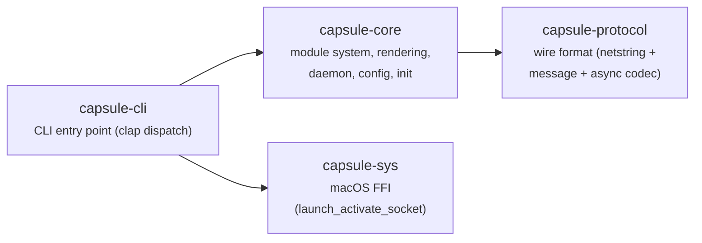
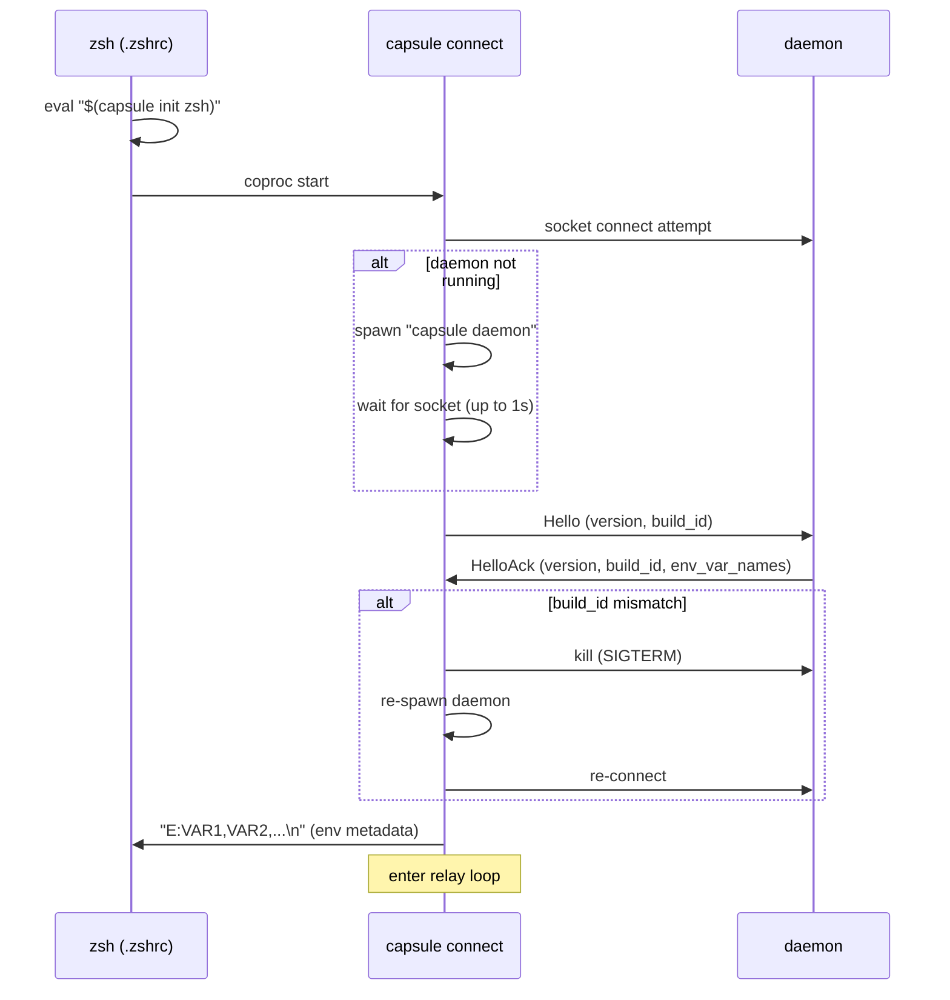
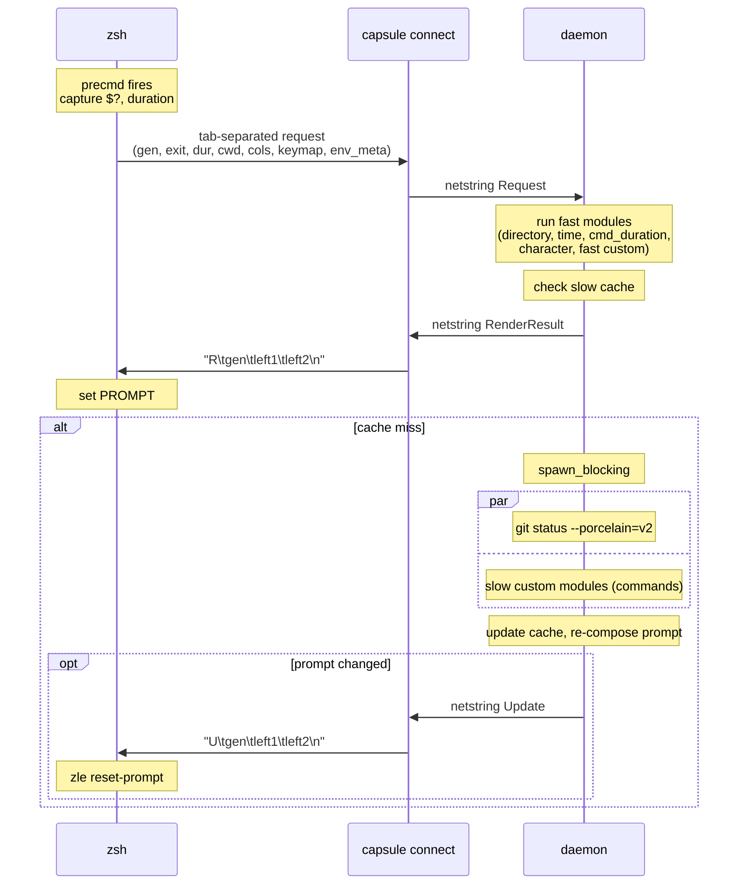
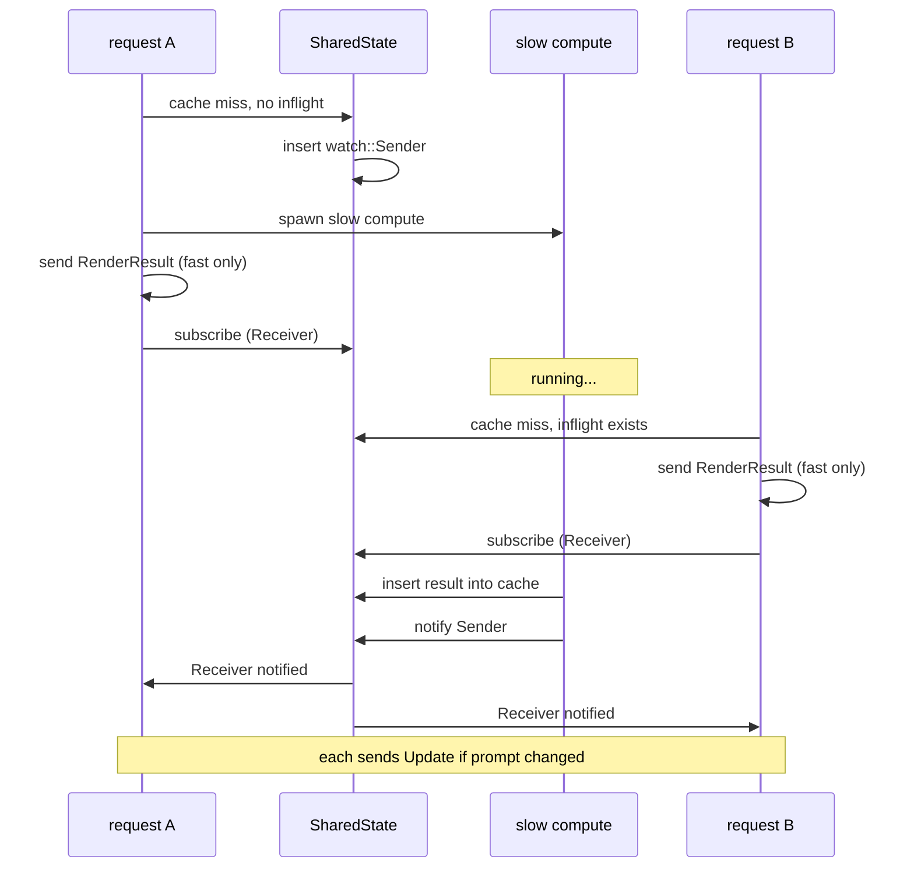
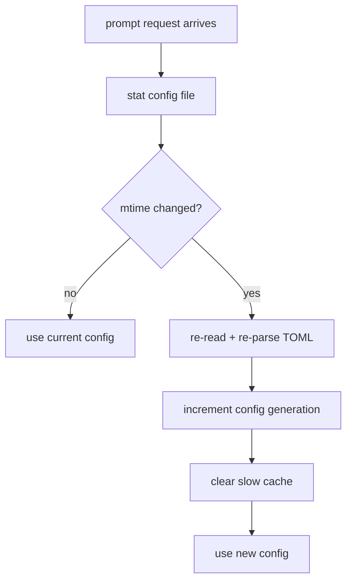
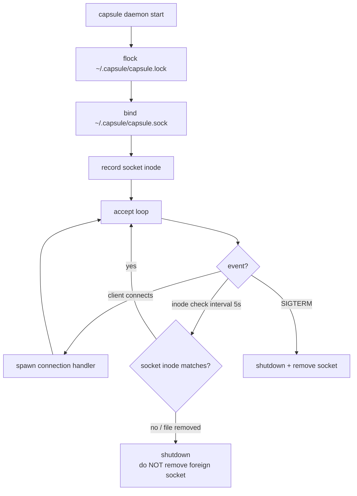

# Architecture Baseline — capsule v1

## Goal

macOS + zsh 専用の Rust 製プロンプトエンジン。常駐 daemon が prompt の計算・レイアウト・レンダリングを担い、zsh 側は coproc relay 経由の薄い glue に徹する push-lite アーキテクチャ。

## Core Boundaries



依存方向は一方向。unsafe は sys crate のみに閉じ込め。

## Constraints

- Target: macOS + zsh (Linux は socket path fallback のみ)
- Single binary (`capsule`) で daemon / connect / init を提供
- Runtime: tokio current_thread
- Lint: unsafe_code 禁止 (sys 除く)、unwrap/expect/todo/dbg!/panic 禁止 (Cargo.toml lints)
- CI: macOS runner

## System Flow

### Startup



### Per-Prompt Request Pipeline



### Concurrent Slow Compute Coalescing

同一 cwd + config generation の slow compute が同時に複数発生した場合、最初のリクエストだけが実際に spawn し、後続は watch channel で結果を待つ。



### Config Hot-Reload



### Daemon Lifecycle (Bound Mode)



## Prompt Layout

```
Line 1 (info):   [directory] on [icon branch [indicators]] via [icon value] took [duration]
Line 2 (input):  at [time] [character]
```

レスポンシブ truncation: terminal width を超える場合、(1) directory を truncate、(2) line 1 の右側セグメントを順に drop。

## Key Tech Decisions

| Decision | Choice | Rationale |
|---|---|---|
| Runtime | tokio current_thread | 1 session 1 connection。multi-thread の overhead 不要 |
| IPC | Unix domain socket | macOS native、低遅延、zsh から coproc 経由で接続 |
| Wire format | daemon-connect: Netstring + LF / shell-connect: Tab + LF | daemon 間は binary-safe netstring。shell 間は zsh native の tab split で十分 |
| Git | `Command::new("git")` + GitProvider trait | v1 は CLI 呼び出し。trait で将来の gix 移行に備える |
| Daemon startup | launchd socket activation (macOS), standalone fallback | `launch_activate_socket` FFI (sys crate) → fd → listener。standalone: flock + bind |
| zsh integration | coproc protocol translator (`capsule connect`) | zsocket 不要。connect が netstring - tab 変換を担い、shell は protocol 非依存 |
| Socket path | `~/.capsule/capsule.sock` | launchd plist で $HOME 展開可能。sun_path 104 bytes 制限回避 |
| Session ID | 64-bit random hex (16 chars) | PID は再利用される。connect 側で生成 |
| Generation | u64 monotonic counter (per-session) | stale request 検出 + slow update 破棄 |
| Module trait | sync (daemon が slow module を spawn_blocking) | async trait object の制約を回避 |
| Config | TOML, mtime-based hot-reload | daemon 再起動不要。parse error 時は defaults fallback |
| Cache | LRU (1024 entries, key = cwd + config_generation + dep_hash) | slow module 結果の再利用。dep_hash が env/file 依存を反映するため TTL 不要 |
| Slow coalescing | watch channel per cache key | 同一 cwd への concurrent request で重複 spawn を防止 |

## Revisit Trigger

- multi-user / multi-session を同一 daemon で扱う必要 -> runtime を multi-thread に変更
- gix が十分安定 -> GitProvider 実装を差し替え
- Linux を first-class support -> socket path、zsh 前提の再検討
